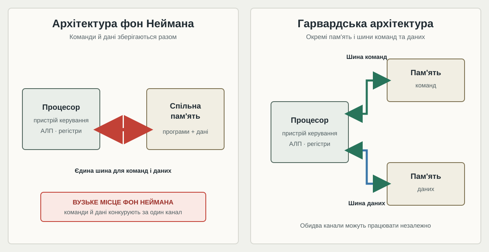

# Домашня робота 1
## Завдання №1
## Архітектури фон Неймана та Гарвардська

## Завдання №2

Я б класифікувала ці пристрої так:

- **Смартфон — MIMD.** У смартфоні є кілька обчислювальних ядер, які можуть одночасно виконувати різні команди над різними даними. Наприклад, одне ядро може обробляти інтерфейс, а інше — мережеві задачі.
- **Мікроконтролер пральної машини — SISD.** Зазвичай він послідовно виконує одну команду над даними: зчитує показники датчиків і керує двигуном, нагріванням та насосом. Це відповідає одному потоку команд і одному потоку даних.
- **Відеокарта ігрової консолі — SIMD.** Графічний процесор паралельно виконує однакові операції над багатьма елементами зображення, наприклад над пікселями. Якщо розглядати всю консоль, то її центральний процесор і відеокарта можуть паралельно виконувати різні команди, тому система загалом поєднує принципи MIMD і SIMD.

## Завдання №3

У твердженні: “У Гарвардській архітектурі команди й дані зберігаються в одній пам’яті, тому вибірка команди й читання даних відбуваються по черзі через ту саму шину” - є помилкою саме назва архутектури, тому що вибірка команди й читання даних відбувається через одну шину в архітектурі фон Неймана.