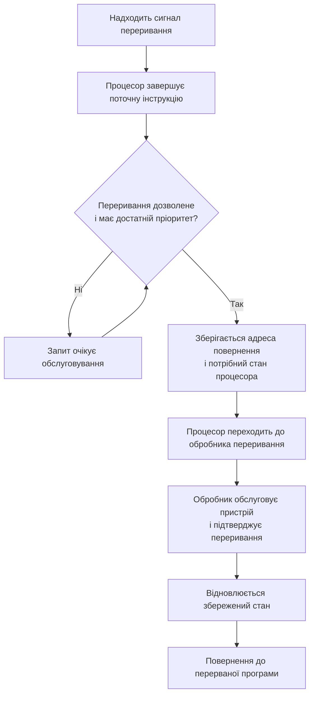

# Домашня робота з лекції № 10

### 1. Послідовність обробки переривання

За пам'яттю відтворив послідовність від появи запиту до продовження перерваної програми. Після надходження сигналу процесор завершує поточну інструкцію, перевіряє запит і його пріоритет. Якщо запит дозволено обслуговувати, процесор зберігає стан програми, передає керування обробнику, а після його завершення відновлює стан і продовжує виконання програми.

### 2. Класифікація ситуацій

| Ситуація | Тип | Пояснення |
|---|---|---|
| Користувач натиснув клавішу на клавіатурі | Апаратне переривання | Контролер клавіатури надсилає процесору асинхронний сигнал про подію. |
| Програма спробувала поділити число на нуль | Виняток | Помилка виникає синхронно під час виконання інструкції ділення. |
| ОС зупиняє програму на точці зупинки в дебагері | Пастка (trap) | Виконання спеціальної breakpoint-інструкції навмисно викликає синхронний перехід до системного обробника/налагоджувача. |

Пастка в цьому прикладі є навмисно викликаною синхронною подією; у деяких системах її також описують як окремий різновид програмного винятку.

### 3. Чому обробник не повинен довго читати з диска

Обробник переривання має виконуватися якомога швидше. Читання з диска може тривати довго, тому під час такого очікування процесор надмірно довго залишався б у режимі обробника замість виконання звичайних програм та швидкого обслуговування інших пристроїв. Зазвичай обробник лише підтверджує переривання, зберігає потрібну інформацію та запускає або планує подальше читання, яке виконується поза короткою критичною частиною обробника.

Поки обробник працює, переривання того самого або нижчого пріоритету зазвичай маскуються чи відкладаються в очікуванні. Вони будуть оброблені пізніше, коли поточний обробник завершиться або знову дозволить їх обслуговувати. Переривання вищого пріоритету може перервати поточний обробник, якщо підтримуються вкладені переривання і вони не заборонені. Точна поведінка залежить від архітектури та налаштування пріоритетів.