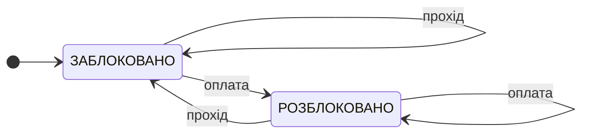

# Домашня робота з лекції № 4

### 1. Таблиця переходів JK-тригера

У таблиці `Qₙ` — поточний стан тригера, а `Qₙ₊₁` — стан після активного фронту тактового сигналу.

| J | K | Наступний стан `Qₙ₊₁` | Дія |
|---:|---:|---|---|
| 0 | 0 | `Qₙ` | Зберігання поточного стану |
| 0 | 1 | `0` | Скидання |
| 1 | 0 | `1` | Установлення |
| 1 | 1 | `¬Qₙ` | Інвертування (перемикання) |

JK-тригер вважають універсальним порівняно з RS-тригером, оскільки він реалізує зберігання, скидання й установлення, а комбінація `J = K = 1` додатково перемикає вихід. У класичному RS-тригері комбінація одночасної активації Set і Reset є забороненою або невизначеною, тоді як у JK-тригері відповідна комбінація має визначену дію — інвертування стану.

### 2. Граф переходів автомата турнікета

У цій моделі вихід автомата — положення турнікета: у стані `ЗАБЛОКОВАНО` прохід закритий, а в стані `РОЗБЛОКОВАНО` прохід дозволений. Подія «оплата» розблоковує турнікет, а подія «прохід» після розблокування знову його блокує. Інші події не змінюють стан.

Це **автомат Мура**, оскільки вихід (положення турнікета і доступність проходу) визначається поточним станом, а не безпосередньо вхідною подією. Події підписані на переходах, але самі переходи не задають окремого вихідного сигналу. Якщо б вихідні сигнали формувалися саме під час переходів і залежали від поєднання стану та події, таку модель можна було б описати як автомат Мілі.

### 3. Паралельний і зсувний регістри

Для побудови 4-бітного паралельного регістра потрібно взяти чотири D-тригери й об'єднати їхні входи тактування в спільну лінію `CLK`. На входи `D` подаються чотири біти слова (`D₃`, `D₂`, `D₁`, `D₀`), а виходи тригерів утворюють відповідні біти збереженого слова (`Q₃`, `Q₂`, `Q₁`, `Q₀`). На активному фронті тактового сигналу всі чотири біти одночасно записуються у свої тригери й залишаються на виходах до наступного запису.

У 4-бітному зсувному регістрі біти надходять послідовно. На кожному тактовому імпульсі вміст пересувається між сусідніми тригерами, а новий біт записується в перший розряд. Тому те саме слово паралельний регістр може прийняти за один тактовий імпульс, тоді як зсувний регістр набирає його послідовно — за чотири імпульси для чотирьох бітів. Під час зсуву попередній вміст розрядів переміщується, а крайній біт виходить із регістра; отже, миттєві значення на виходах відрізнятимуться від паралельного регістра до завершення завантаження всього слова.