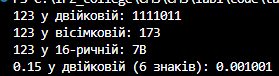
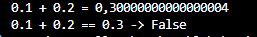

# Практична робота №1
**Тема:** Системи числення і машинне представлення даних

**Варіант:** № 10

**Вхідні дані:**
* $N = 123$
* $F = 0.15$
* $A = 60, B = -20$
* $C = 48.5$

## Завдання 1. Ручне переведення чисел між системами числення
### 1.1 Переведення цілого числа 123

**У двійкову систему:**
* $123 : 2 = 61$ (остача **1**)
* $61 : 2 = 30$ (остача **1**)
* $30 : 2 = 15$ (остача **0**)
* $15 : 2 = 7$ (остача **1**)
* $7 : 2 = 3$ (остача **1**)
* $3 : 2 = 1$ (остача **1**)
* $1 : 2 = 0$ (остача **1**)

*Результат:* **123 = 1111011**


**У вісімкову систему:**
* $123 : 8 = 15$ (остача **3**)
* $15 : 8 = 1$ (остача **7**)
* $1 : 8 = 0$ (остача **1**)

*Результат:* **123 = 173**


**У шістнадцяткову систему:**
* $123 : 16 = 7$ (остача **11** = **B**)
* $7 : 16 = 0$ (остача **7**)

*Результат:* **123 = 7B**

### 1.2 вигляд (6 знаків після коми)


* $0.15 \times 2 = 0.30$ - (ціла частина **0**)
* $0.30 \times 2 = 0.60$ - (ціла частина **0**)
* $0.60 \times 2 = 1.20$ - (ціла частина **1** (залишок $0.20$))
* $0.20 \times 2 = 0.40$ - (ціла частина **0**)
* $0.40 \times 2 = 0.80$ - (ціла частина **0**)
* $0.80 \times 2 = 1.60$ - (ціла частина **1** (залишок $0.60$))

*Результат:* **$0.15 \approx 0.001001$**

## Завдання 2. Програма-конвертер на C# та перевірка 
### Код програми

[Переглянути повний код у файлі Program.cs](./code/task2/Program.cs)

### Вивід програми:


Вивід програми повністю збігається з ручними розрахунками.

## Завдання 3. 8-бітний додатковий код та аналіз переповнення

Дано пара чисел: $A = 60, B = -20$.

1. **Запис у 8-бітному додатковому коді:**
* $A = +60$:
Прямий / додатковий код: **`00111100`** (знаковий біт `0`).
* $B = -20$:
* Модуль $+20 = 00010100_2$
* Інверсія (зворотний код): $11101011$
* $+ 1$ (додатковий код): $11101011 + 1 =$ **`11101100`**

2. **Додавання в стовпчик:**
```text
  00111100  ( 60)
+ 11101100  (-20)
----------
 100101000

```

Девотибітне перенесення (`1`) відкидається в 8-бітному регістрі.
Отриманий 8-бітний код: **`00101000`**
3. **Переведення суми у десяткову систему:**
* $00101000 = 2^5 + 2^3 = 32 + 8 = 40$.

4. **Визначення переповнення (Overflow):**
* Сума $60 + (-20) = 40$ потрапляє в знаковий 8-бітний діапазон $[-128..+127]$.
* Оскільки доданки мають різні знакові біти (`0` та `1`), переповнення арифметично неможливе.
* **Висновок:** Переповнення відсутнє (**Overflow = False**).

## Завдання 4. Розбір числа $C = 48.5$ за форматом IEEE 754 single (32 біти)

### 4.1 Прямий розбір у 32-бітний запис:

1. **Знак (1 біт):**
Число додатне $\rightarrow \mathbf{S = 0}$.
2. **Переведення модуля у двійкову систему:**
$48_{10} = 110000_2$,  $0.5_{10} = 0.1_2$
$\vert{}C\vert{} = 48.5_{10} = 110000.1_2$
3. **Нормалізація ($1.xxx \times 2^p$):**
$110000.1_2 = 1.100001_2 \times 2^5 \rightarrow$ порядок $p = 5$.
4. **Порядок зі зміщенням 127 (8 біт):**
$E = p + 127 = 5 + 127 = 132_{10}$.
$132_{10} = \mathbf{10000100_2}$.
5. **Мантиса (23 біти):**
Дробова частина після коми з нормалізованої форми: `100001`.
Доповнюємо нулями праворуч до 23 бітів:
**`10000100000000000000000`**

**Підсумковий 32-бітний запис (IEEE 754):**

`01000010010000100000000000000000`


### 4.2 Відновлення значення з 32 бітів:

* $S = 0 \rightarrow (-1)^0 = +1$
* $E = 10000100 = 132 \rightarrow p = 132 - 127 = 5$
* $M = 1.100001 = 1 + 2^{-1} + 2^{-6} = 1 + 0.5 + 0.015625 = 1.515625$
* **Значення:** $+1 \times 1.515625 \times 2^5 = 1.515625 \times 32 = \mathbf{48.5}$.

*Значення відновлено вірно і збігається з початковим $C = 48.5$*.

## Завдання 5. Похибка представлення дробів у C#
### Код програми

[Переглянути повний код у файлі Program.cs](./code/task5/Program.cs)

### Вивід програми:



**Пояснення причини:**

Більшість десяткових дробів (таких як $0.1$ та $0.2$) у двійковій системі числення є нескінченними періодичними дробами ($0.00011001100...$). Оскільки тип `double` має обмежену розрядність мантиси (52 біти), ці числа зберігаються з округленням. Накопичена похибка призводить до того, що сума дорівнює `0.30000000000000004`, а оператор точної рівності `==` повертає `False`.

## Висновок

У ході виконання практичної роботи були закриплені навички переведення цілих чисел та дробів між десятковою, двійковою, вісімковою та шістнадцятковою системами числення. Написана програма на мові C# підтвердила точність виконаних ручних розрахунків для числа $N = 123$ та дробу $F = 0.15$. Для пари чисел $A = 60$ і $B = -20$ виконали додавання в 8-бітному додатковому коді та встановили відсутність переповнення. Також було розібрано число $C = 48.5$ у форматі IEEE 754 single та продемонстровано механізм виникнення похибки при роботі з дробовими числами у двійковій системі.

## Контрольні запитання

1. **Чому ціле переводять діленням, а дріб множенням на основу системи?**
*Відповідь:* Ціла частина числа відповідає додатним степеням основи ($q^0, q^1, q^2...$), тому ділення дозволяє послідовно виділяти остачі (цифри) від молодших до старших разрядів. Дробова частина розкладається за від'ємними степенями ($q^{-1}, q^{-2}...$), тому множення переносить цифри дробу у цілу частину від старших знаків після коми до молодших.

2. **Як за додатковим кодом двох доданків визначити переповнення, не переводячи суму в десяткову систему?**
*Відповідь:* Переповнення виникає тоді і тільки тоді, коли знакові (старші) біти обох доданків однакові ($0+0$ або $1+1$), а знаковий біт отриманої суми відрізняється від них.

3. **З яких трьох компонентів складається число у форматі IEEE 754 single і яка розрядність кожного?**


*Відповідь:*
* Знак (Sign) — **1 біт**;
* Порядок зі зміщенням +127 (Exponent) — **8 біт**;
* Мантиса (Mantissa) — **23 біти**.

4. **Чому вираз `0.1 + 0.2 == 0.3` дає хибний результат і як правильно порівнювати дробові числа?**
*Відповідь:* Результат хибний через похибку округлення двійкових нескінченних періодичних дробів при збереженні в мантисі. Дробові числа слід порівнювати через абсолютну різницю із заданим допуском точності (епсилон): `Math.Abs(a - b) < 1e-9`.