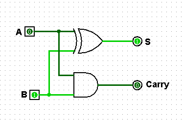
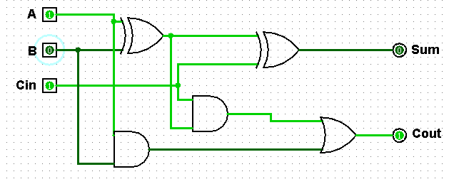
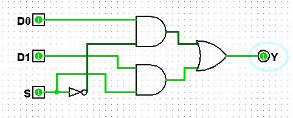
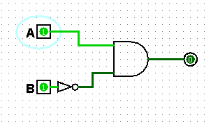

# Практична робота №2
## Завдання №1

Для виконання практичної роботи №2 було встановлено Logisim Evolution.

## Завдання №2
Зібрано схему півсуматора. Під час прерірки результату роботи схему дані збіглися з таблицею істинності для півсуматора.

## Завдання №3
Зібрано схему повного суматора. Під час прерірки результату роботи схему дані збіглися з таблицею істинності для повного суматора.

## Завдання №4
Зібрано схему мультиплексора без використання готової схеми з бібліотеки Plexers. Під час прерірки результату роботи схему дані збіглися з таблицею істинності для мультиплексора.

## Завдання №5. Ватіант №10
### Таблиця істинності

| A | B | F |
| --- | --- | --- |
| 0 | 0 | 0 |
| 0 | 1 | 0 |
| 1 | 0 | 1 |
| 1 | 1 | 0 |

### ДДНФ
$F(A, B) = A \land \neg B$)

### Схема згідно варіанту

Схема повертає індентичний результат з таблиці істинності.