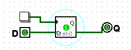
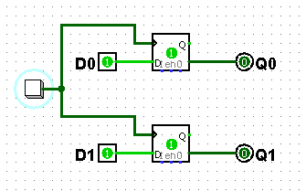
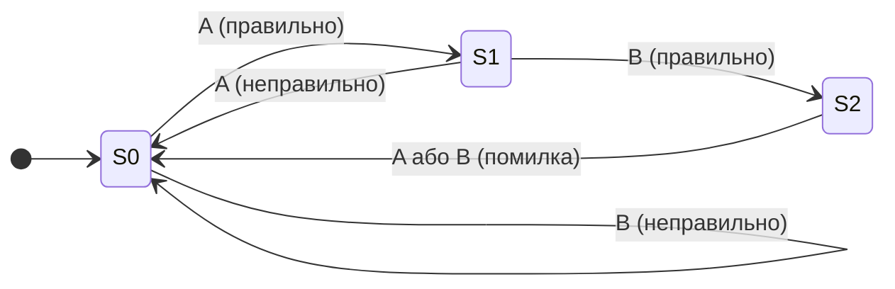
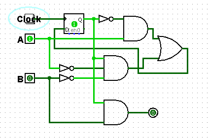
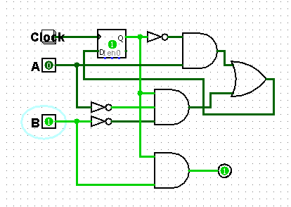
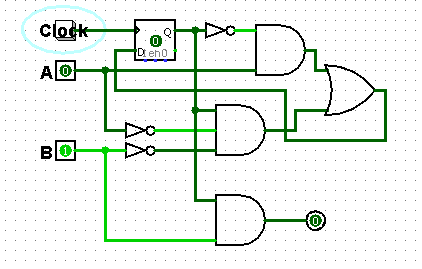

# Практична робота №3
## Завдання №1

В цьому завданні було складено D-тригер в середовищі Logisim.

## Завдання №2

На зображенні зібрана схема, на якій з двох D-тригерів 2-розрядний паралельний регістр зі спільним тактовим входом.

## Завдання №3

### Граф переходів автомата кодового замка

Код замка складається з двох натискань: `A`, а потім `B`.

- **S0** — замок заблокований; код ще не починається.
- **S1** — уведено перший правильний символ `A`.
- **S2** — замок розблокований; код `A, B` виконаний правильно.
- При помилці невірного символу автомат повертається в **S0**.
- Після розблокування будь-який натиск скинує замок у **S0**.

## Завдання №4

### Схеми з Logisim

## Завдання №5

Під час перевірки зібраного автомату спершу було подано правильну послідовність з коду, в результаті, переконалася, що вихід "розблоковано" активується лише в кінці, а при не правильній послідовності звірилася, що автомат повертається в S0.