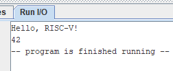
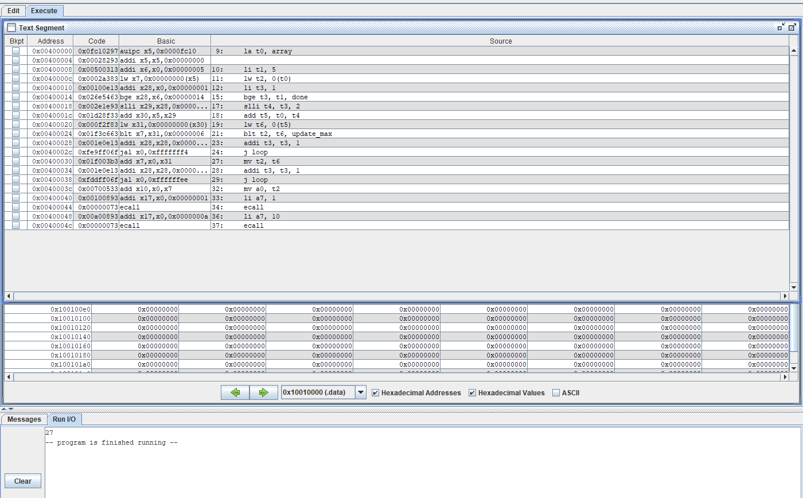
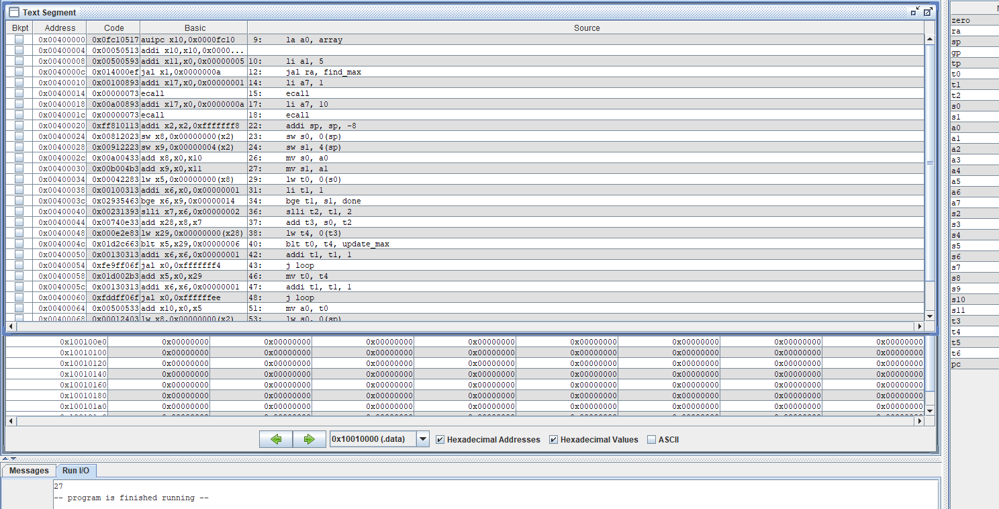
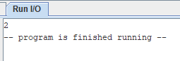
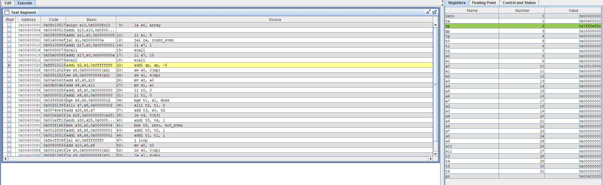
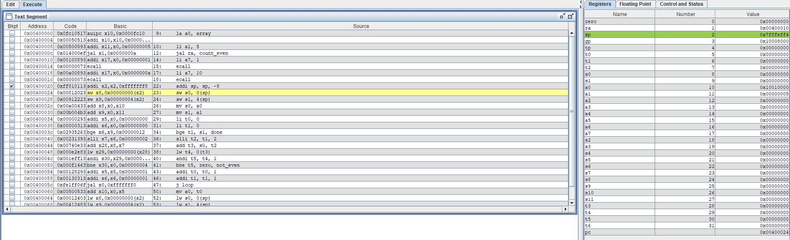
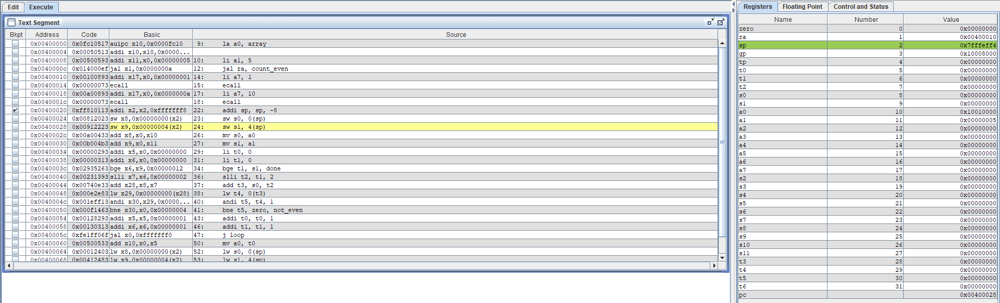
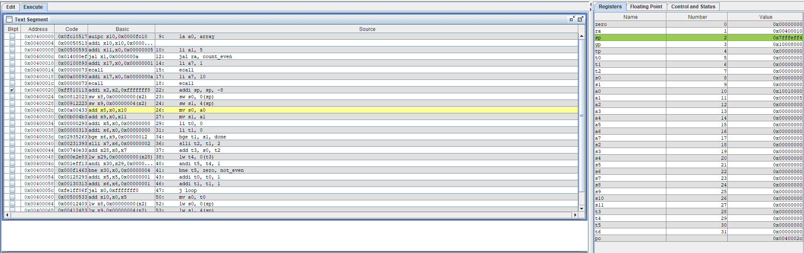

# Лабораторна робота № 4

## Робота з масивами та підпрограмами в RARS

### Мета роботи

Навчитися виводити дані за допомогою системних викликів RARS, обходити масив у пам'яті та реалізовувати підпрограми з передаванням аргументів через `a0` і `a1`. Закріпити призначення регістра адреси повернення `ra` і збережуваних регістрів `s`.

## Хід роботи

### 1. Виведення рядка та числа

У програмі рядок оголошено директивою `.asciz` (він завершується нульовим байтом). Системний виклик `a7 = 4` виводить рядок за адресою в `a0`. Далі в `a0` завантажується число `42`, а виклик `a7 = 1` виводить його як ціле число. Програма завершується викликом `a7 = 10`.

Очікуваний вивід у Run I/O:

```text
Hello, RISC-V!
42
```

На знімку зафіксовано успішне асемблювання без повідомлень про помилки.



### 2. Пошук максимуму масиву

Масив містить числа `12, 5, 27, 8, 19`. У `t1` зберігається індекс поточного елемента. Перевірка `bge` завершує цикл, коли індекс дорівнює довжині масиву. Перевірка `blt` оновлює поточний максимум, якщо знайдений елемент більший. Програма виводить `27` — найбільше число масиву.

Результат виконання — `27`.



### 3. Пошук максимуму як підпрограма

Підпрограмі `find_max` передаються адреса масиву в `a0` і його довжина в `a1`. Після завершення в `a0` повертається максимум. Виклик виконується інструкцією `jal`. Підпрограма зберігає використані регістри `s0` і `s1` у стеку та відновлює їх перед `ret`.

Результат збігається з попереднім кроком — `27`.



### 4. Підпрограма для 10-го варіанта: кількість парних елементів

Для масиву `3, 8, 11, 6, 9` підпрограма `count_even` рахує елементи, у яких наймолодший біт дорівнює нулю. Операція `andi` з маскою `1` визначає парність числа. Підпрограма повертає кількість парних елементів у `a0`.

#### Ручний розрахунок

| Елемент | Перевірка | Результат |
|---:|---|---|
| 3 | непарне | не враховується |
| 8 | парне | лічильник = 1 |
| 11 | непарне | без змін |
| 6 | парне | лічильник = 2 |
| 9 | непарне | без змін |

Отже, у масиві два парні числа: `8` і `6`. Очікуваний і отриманий у RARS результат — `2`.



### 5. Покрокове виконання підпрограми

Точку зупинки встановлено на першій інструкції `count_even`. Далі виконано три послідовні команди `Step`. У таблиці наведено значення в момент, коли відповідна інструкція стала поточною (після попереднього кроку). Робочий регістр циклу — `t1`; на цих трьох інструкціях його значення ще не змінюється, оскільки ініціалізація циклу (`li t1, 0`) виконується пізніше.

| Стан | Поточна інструкція | `a0` | `a1` | `t1` |
|---|---|---:|---:|---:|
| Точка зупинки | `addi sp, sp, -8` | `0x10010000` | `5` | `0` |
| Після 1-го `Step` | `sw s0, 0(sp)` | `0x10010000` | `5` | `0` |
| Після 2-го `Step` | `sw s1, 4(sp)` | `0x10010000` | `5` | `0` |
| Після 3-го `Step` | `mv s0, a0` | `0x10010000` | `5` | `0` |

Знімки покрокового виконання (в порядку виконання інструкцій):

1. Точка зупинки на вході в підпрограму:

   

2. Після першого кроку:

   

3. Після другого кроку:

   

4. Після третього кроку:

   

## Висновок

У роботі реалізовано обхід масиву, пошук максимального елемента та підрахунок парних елементів із використанням підпрограм. `jal` записує адресу повернення в `ra`, а `ret` переходить за цією адресою, щоб продовжити виконання після виклику. Регістри `s0` і `s1` підпрограма використовує для значень, які мають зберегтися між викликами; тому вона зберігає їх у стеку на вході та відновлює перед поверненням.